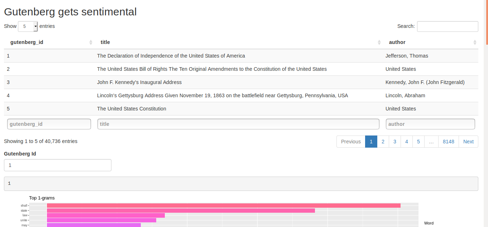
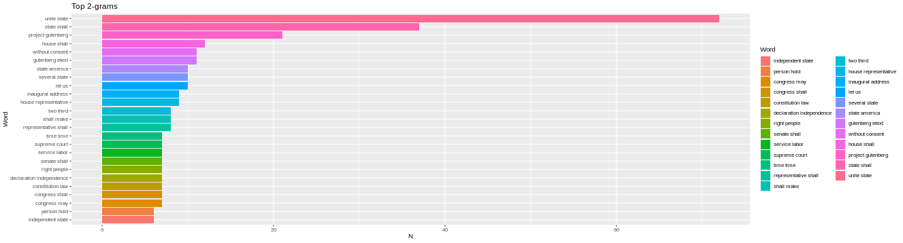
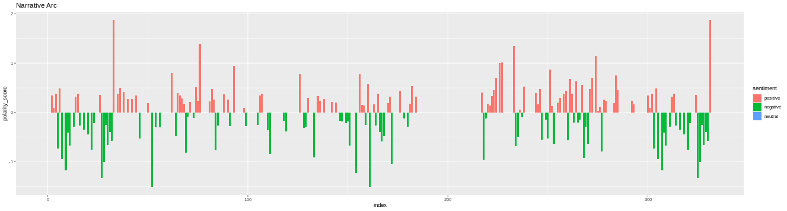
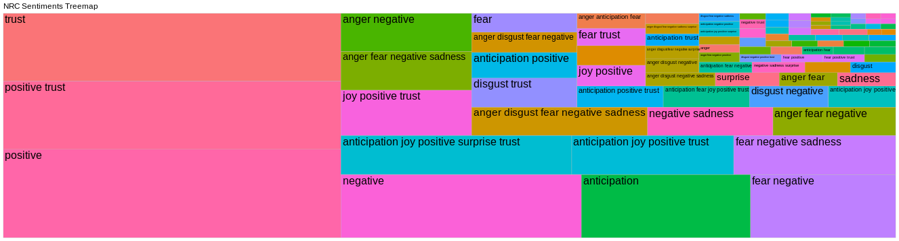
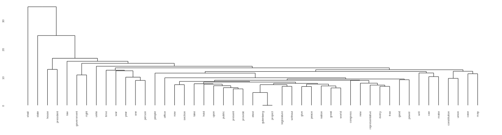

# Gutenberg Gets Sentimental
Sentiment analysis of Gutenberg project

The goal of this project is provide a automated dashboard with the sentiment analysis in the books of the Gutenberg Project.
The app make itself all word preprocessing and create the necessary databases to make the plots and the clustering.

# Running

To run this app you need to change the paths inside the code, is in the very beginning, to run locally, and install the necessary R
libraries inside the code. You only need to have the "processing.R" file somewhere in your local machine, and change the source path of the 
"app.R" file and run it. After that you'll have a screen like that:

You only need to by author or title and figure out what is the gutenberg id of the book and put into the box and the app will preprocess
the text and make the plot to you derive insights about the sentiments of the book. With the topd 1,23-grams, the narrative arc with
the , the 
sentiments treemap. And a dendogram with the  of the text,
using the paragraphs as elements, and try to see wich words appear together.

# Further improvements

Actually the preprocessinng step of the data may not be enough to clean the data, so if want to make a more acurated analysis you 
may need to to do more preprocessing. And the sentiment databases used may not have more erudited words such as found in some books of
the Gutenberg Project.

# License

This project is licensed under the MIT License 
